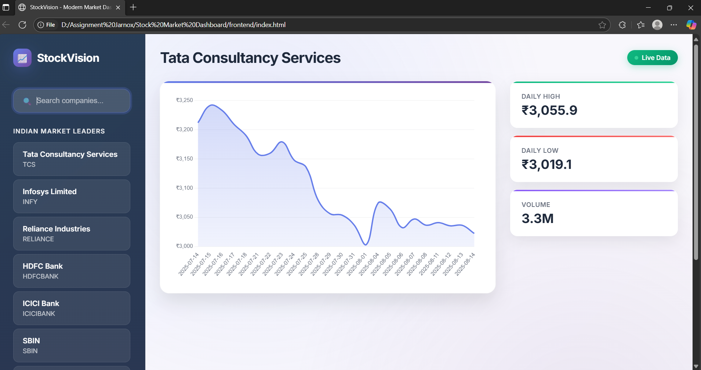

📊 StockVision - Modern Stock Market Dashboard

A sleek and modern stock market dashboard web app I built to track real-time stock prices, daily highs/lows, and trading volume for major Indian companies.
The backend is powered by FastAPI, and the frontend is a custom HTML/CSS/JavaScript app with interactive charts using Chart.js.

✨ Features

🖥 Sleek modern UI with gradient backgrounds and smooth animations

🔍 Quickly search for any company and see its stock info

📈 Interactive line charts that make trends easy to spot

📡 Live data indicator to show when stock info is updating

📊 Stats panel displaying:

Daily High

Daily Low

Trading Volume

📱 Fully responsive design for desktop, tablet, and mobile

🕒 Thoughtful loading and empty states for a smooth user experience

🛠 Tech Stack

Frontend:

HTML, CSS, JavaScript

Chart.js with chartjs-adapter-date-fns for date formatting

Google Fonts (Inter)

Backend:

Python

FastAPI

yfinance (for fetching stock market data)

📦 Installation & Setup
1️⃣ Clone the repository
git clone https://github.com/YourUsername/stock-market-dashboard.git
cd stock-market-dashboard

2️⃣ Backend Setup
cd backend
python -m venv .venv
# Windows
.venv\Scripts\activate
# Mac/Linux
source .venv/bin/activate

pip install -r requirements.txt
uvicorn main:app --reload

The backend should now be running at: http://127.0.0.1:8000

3️⃣ Frontend Setup

You can serve the frontend using Python’s built-in server:

cd frontend
python -m http.server 5500

Then open http://127.0.0.1:5500 in your browser.

📸 Preview

Here’s a quick look at the dashboard in action:

